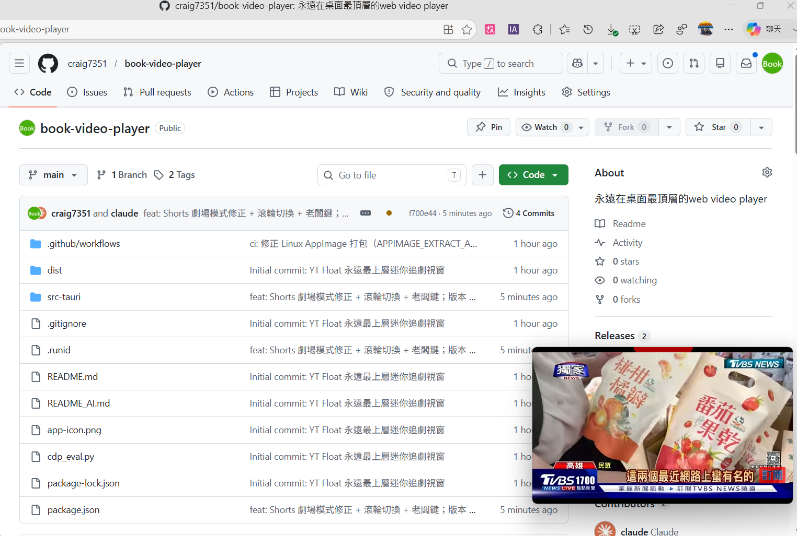

# YT Float · 永遠最上層的迷你追劇視窗

一個極省資源的浮動瀏覽器，可釘在螢幕右下角「邊工作邊看」YouTube / Netflix / Bilibili。

基於 **Tauri v2 + 系統內建 WebView2**：不像 Electron 要打包整份 Chromium，而是共用系統 Edge 引擎，殼層程式只佔約 **35–50 MB** 記憶體，執行檔極小。

---

## 📸 畫面截圖

| 一般 YouTube 影片 | 🎬 只看影片（劇場模式） |
|:---:|:---:|
|  |  |
| 完整 YouTube 介面，浮動於右下角 | 一鍵隱藏其餘介面，影片填滿整個小視窗 |

| YouTube Shorts 短影音 | 永遠最上層・邊工作邊看 |
|:---:|:---:|
|  |  |
| 直式短影音，🎬 填滿 + 滾輪上下切換 | 釘在桌面右下角，蓋在工作視窗之上 |

---

## ✨ 功能

- **永遠最上層**：釘在所有視窗之上，拖到右下角邊工作邊看
- **無邊框迷你視窗**：預設開在螢幕右下角，可自由縮放
- **可拖曳/可縮放**：頂部紅色握把拖曳移動；拖四邊/四角縮放
- **自動隱藏網址列**：平常畫面 100% 乾淨，需要時才滑出
- **上一頁 / 下一頁**
- **三大服務快速捷徑**：YouTube / Netflix / Bilibili 一鍵跳轉
- **🎬 只看影片**：一鍵隱藏頁面其餘部分，播放器填滿整個視窗（支援 YouTube、Bilibili；Netflix 本來就是全畫面）
- **新分頁攔截**：把「開新分頁」的連結改在同一視窗開啟（修正 Bilibili 點影片沒反應）
- **🕶️ 老闆鍵 `Ctrl+Shift+Z`**：全域熱鍵，老闆走過來時一鍵**瞬間隱藏視窗並暫停影片**（連工作列都不留、聲音不外漏），再按一次還原
- **系統匣**：關閉時收到系統匣，可隨時顯示或結束

---

## 🎮 操作方式

視窗無邊框，所有控制集中在頂部一條會自動隱藏的工具列：

```
◀  ▶  [ 網址列 .......... ]  YT  NF  B  🎬  📌  ✕
```

| 操作 | 方式 |
|---|---|
| 移動視窗 | 按住頂部**紅色握把**拖曳 |
| 縮放視窗 | 拖視窗**四邊 / 四角**（隱形感應區） |
| 叫出網址列 | 滑鼠移到視窗頂端 / 點紅握把 / 按 `Ctrl+L` |
| 換網址 | 網址列輸入後按 `Enter`（`Esc` 收起） |
| 上一頁 / 下一頁 | ◀ / ▶ |
| 跳到服務 | **YT** / **NF** / **B** |
| 只看影片 | **🎬**（再按一次還原） |
| 釘住工具列 | **📌**（不自動隱藏） |
| 隱藏到系統匣 | **✕**，或從系統匣圖示「顯示 / 結束」 |
| 🕶️ 老闆鍵 | **`Ctrl+Shift+Z`**（全域，任何程式前景都能觸發；隱藏+暫停，再按還原） |

> **老闆鍵說明**：採用 OS 層全域熱鍵，即使你正在用 Excel / IDE、視窗沒被聚焦也能瞬間觸發。隱藏前會先暫停所有影片，避免視窗藏起來後聲音還在播而穿幫；還原時影片維持暫停（按空白鍵續播），不會在叫回視窗的瞬間突然出聲。

---

## 🛠️ 開發與建置

### 需求
- [Node.js](https://nodejs.org/) 18+
- [Rust](https://www.rust-lang.org/tools/install)（含 cargo）
- Windows 10/11（內建 WebView2 Runtime；Win10 若無可至微軟官網安裝）

### 安裝
```bash
npm install
```

### 開發模式（即時執行）
```bash
npm run tauri dev
```

### 打包成獨立執行檔
```bash
npm run tauri build
# 或只要單一 exe：
cargo build --release --manifest-path src-tauri/Cargo.toml
```
產物：`src-tauri/target/release/yt-float.exe`（單檔，雙擊即用）。

---

## 📁 專案結構

```
.
├── package.json              # Tauri CLI 指令
├── dist/index.html           # 佔位頁（實際載入遠端網站）
└── src-tauri/
    ├── tauri.conf.json       # 視窗設定：無邊框 / 最上層 / 圖示
    ├── src/main.rs           # 建立視窗、系統匣
    ├── overlay.js            # ⭐ 核心：注入工具列 + 拖曳/縮放/劇場模式/新分頁攔截
    ├── capabilities/default.json  # 視窗權限（含遠端網域授權）
    └── icons/                # 應用程式圖示
```

> 核心邏輯幾乎都在 `overlay.js` —— 它被以注入腳本的方式塞進每個載入的網頁，建立懸浮工具列並與 Rust 端的視窗 API 溝通。

---

## ⚙️ 技術重點

- **單一 WebView，直接載入遠端網站**（不自己寫前端），最省資源。
- 工具列、拖曳條、縮放感應區、劇場模式、新分頁攔截，全部由 `overlay.js` 一支注入腳本完成。
- 視窗控制（拖曳、縮放）透過 Tauri v2 的 `startDragging()` / `startResizeDragging()`。
- 想了解架構細節與「踩過的坑」，請看 [`README_AI.md`](./README_AI.md)。

---

## 📝 授權

個人用途自由使用。各影音服務內容版權歸原權利人所有，本工具僅為瀏覽器外殼。
